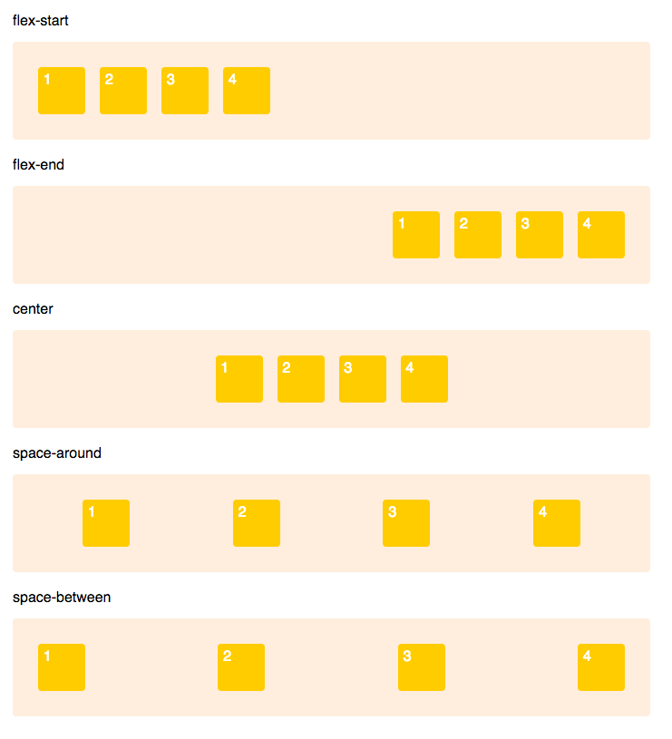
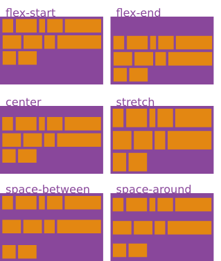

# :muscle: An Introduction to Flex

## Displays

A commonly used property in CSS is `display`. This specifies how the element is displayed (if it is shown at all). By default, the display value is either `block` or `inline`, depending on the element (inline elements are things like `a`s, `img`s, `span`s, etc, and block elements are things like `div`s and `form`s)

There is also `display: inline-block`, which treats the element as `inline`, but the element can have a defined width and height, which `inline` elements cannot do on their own.

To hide an element, you set it to `display: none`, this will remove the element from the page. The difference between `display: none` and `opacity: 0` (both of which hide the element) is that changing `opacity: 0` maintains the space the element takes up, whereas `display: none` does not. The element will take up no space. `visibility: hidden` does the same thing as `opacity: 0`, but the element won't show up in the tab order and it won't respond to events (click, keypress, etc).

For a demo of each of these `display`s, see this [codepen demo](http://codepen.io/raemadeline/pen/NNybrP)

## What is `flex` and why is it so cool?

Setting an element to `display: flex` is different than any of the other `display` options described above. This display allows all of the direct children of the element to move flexibly within the space the parent takes up. This is valuable for reusing components that might have vastly different content within (like panels!).

You might see `flex` in CSS labeled as `flex-box`, this is an older naming convention that has since been simplified to just `flex` but it is still supported by older browsers and out-of-date documentation.

Flex is generally supported by most major browsers, but depending on what you're trying to support you may need to use a vendor prefix. Either check out [CanIUse](http://caniuse.com/#feat=flexbox) or install an [Autoprefixer](https://github.com/postcss/autoprefixer) to handle it for you.

## How do I use it?

In addition to adding the property `display: flex` to your parent element, you have to do a bit more work to get the layout of your dreams to become a reality (unless all the default values work out in your favor!). Additional properties are required on the parent, and often the child elements as well.

Success in building flex layouts largely comes from practice, and seeing the code in action. I strongly encourage you to check out the codepen demos for each property and to tinker around with them and see how the layout changes.

### The Parent Element

Below are all the additional `flex` properties you can apply to the parent element. Note that none of these properties really work unless you include the property `display: flex` in your declaration.

#### `flex-direction`

This determines the layout's main axis, row or column. It also allows you to choose if you want the elements to move forwards or backwards. The options are `row`, `row-reverse`, `column`, `column-reverse`. The default value is `row`, meaning the elements flow from left to right.

[Codepen Demo](http://codepen.io/raemadeline/pen/oLLawL)

#### `flex-wrap`

When you have too many elements and they all do not fit along the main axis in one line, you are given the choice as to whether they wrap around to a second line. By default, the value of `flex-wrap` is `nowrap`, so the elements will do their best to fit in the confined space. You can also set the value to `wrap`, which will start a second line after the first following the direction, and `wrap-reverse`, which will a second line before the first.

[Codepen Demo](http://codepen.io/raemadeline/pen/jrreaQ)

#### `flex-flow`

This is just a shorthand to combine `flex-direction` and `flex-wrap`. The syntax is:

```css
.parent {
  flex-flow: <'flex-direction'> || <'flex-wrap'>
}
```

#### `justify-content`

This determines the spacing of child elements along the main axis. This one is easier to understand visually, so here's an example:



To play around with these values, here's the [Codepen Demo](http://codepen.io/raemadeline/pen/BzzqxV). Try changing around other properties like `flex-direction` to see how these change.

#### `align-items`

`align-items` determines the spacing of child elements along the *secondary* axis, the one perpendicular to the axis specified in `flex-direction`.

http://codepen.io/raemadeline/pen/WxGeNd

#### `align-content`

`align-content` is the same as `align-items`, but it handles the full range of child elements as a block instead of arranging each element in their line. For a better explanation, see the visual below (thanks css-tricks.com)



### The Child Elements

By applying the above properties to the parent element, you can create a lot of awesome layouts. However, you may occasionally want to customize a specific child element of the parent separately from the rest. These are properties you can add to the direct children of a flex parent.

#### `order`

This overrides the ordering of the elements as determined by the parent. By default, every child's `order` is determined by the layout. Generally, you should avoid this and just arrange your HTML such that the elements start in the correct order, but this is useful with responsive designs. See this [Codepen Demo](http://codepen.io/raemadeline/pen/PzGwGw) and try resizing the window. If you look at the HTML, the sidebar is before the main content, but its `order` gets overridden at smaller screen sizes to account for users looking at the page on mobile.

#### `flex-grow`

By default, assuming all `flex` children have the same size internally, they will all grow an equal amount to fill the remaining space left in the parent (assuming their `width` and `height` have not yet been fixed). This property determines the priority of the child to fill up more space. All children have a default of `flex-grow: 0` (will not grow), so if a child is given `flex-grow: 1`, it will take up all the remaining space unless its siblings are also given `flex-grow: 1`.


#### `flex-shrink`

`flex-shrink` is the complement of `flex-grow`. In the case when the parent is too small to comfortably fit all the children, any child with a `flex-shrink` property that's greater than zero will shrink to allow all of the other children to fit. By default, all `flex` children have `flex-shrink: 1`, so if you want them to stay the same size you must explicitly set them to `flex-shrink: 0`.

#### `flex-basis`

The `flex-basis` of a child element is essentially its default size before any elements grow or shrink to fill the parent's space. By default, `auto` means the element's width or height, depending on the `flex-direction`.

#### `flex`

This is a shorthand to combine `flex-grow`, `flex-shrink`, and `flex-basis`. The syntax is:

```css
.child {
  flex: <'flex-grow'> || <'flex-shrink'> || <'flex-basis'>
}
```

You can also just do `flex: 1`, which is a shorthand for `flex: 1 1 0`, meaning the element will grow and shrink as it needs to.

`flex: none` is shorthand for `flex: 0 0 auto`, which means the element will be immune to all the flex magic going on around it.

#### `align-self`

This is similar to the parent property `align-items` in that they both align the element in the axis perpendicular to the `flex-direction`. The key difference here being that `align-self` overwrites the alignment for that element that the parent defined.

[Codepen Demo](http://codepen.io/raemadeline/pen/OXXBRO)

It's important to note that `float`, `clear`, and `vertical-align` properties are ignored on `flex` children.

## Cool Examples

Here are a few demos so you can see some more real-life applications of using `flex`-ible layouts.

### Quick Centering

By giving the parent the properties:

```css
.parent {
  display: flex;
  justify-content: center;
  align-items: center;
}
```

Every direct child of that parent will automatically be centered within the parent without any additional CSS.

http://codepen.io/raemadeline/pen/Pzzpgm

### Full Page Layout

This is just an example of how a standard website would look if it's layout was built entirely with flex. Feel free to play around with this demo and experiment with the values so you can better understand the relationships between these properties.

http://codepen.io/raemadeline/pen/pbbKWG

### Bonus: A Game!

If you feel like practicing using `flex` in your CSS, there's a [Tower Defense game](http://www.flexboxdefense.com/) to make that more fun.

**Next Up: [SASS Variables and Functions](2016-07-13-sass-functions-and-data-structures.md)**
