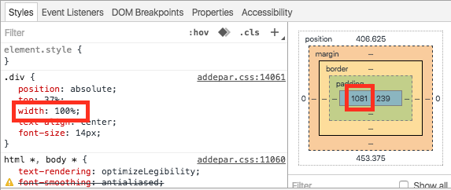

# :eyes: Units

## Pixels

A pixel is considered the smallest base unit, representing a single dot in an image. Every digital image is made up of a grid of pixels.

Here is an example:


*Image courtesy of [wikipedia.](https://en.wikipedia.org/wiki/Pixel)*

Generally when you're declaring the length of something in CSS, it will be using pixels (or `px`).

## Percentage

Percentages are *technically* not a unit of measurement, but they are the second most commonly used method to declare the length (or width, or margin, or anything) so it should still be discussed.

When an element has `width: 50%;`, its width will be 50% of its direct parent's. If its a top-level element (meaning it has no container other than `<body>`), its width will be 50% of the window.

The browser will take this percentage and calculate a pixel value. This value will update whenever the browser resizes so the element always has the correct width. If you open the Chrome Inspector and highlight an element with a percentage width or height, you will be able to see the calculated pixel value in the `Computed` tab.



## Viewport-Relative Measurements

Viewport relative units are percentages of the dimensions of the viewport window. You have `vw` (viewport width), `vh` (viewport height), `vmin` (the smaller of the width and height), and `vmax` (the larger of the two). Each viewport relative unit represents 1/100 of the size of the viewport.

They are mainly used for responsive layouts, as they are more consistent and less fickle than normal percentage layouts.

## Font-Relative Measurements

While the following units of measurement are primarily used for setting `font-size`, they can be used to set other values as well to establish a type-driven page.

### Em

The name `em` initially came from measuring a typeface by the height of the letter `M`. Now it has come to mean the base font size for a typographic system.

Without any CSS, `1em == 16px`. By default, the base font size is `16px`. However `em`s are relative to the `font-size` set in pixels.

For example,

```CSS
.title {
  font-size: 40px;
  padding: 0.5em;
}
```

The padding would be `20px`, as it is `0.5 * 40px`. While this is just a small example, it can be extended pretty aggressively. Using `16px` as a base, you can build out a whole type system using `em`s.

```CSS
small { font-size: 0.5em; /* 8px */ }
p { font-size: 1em; /* 16px */ }
h1 { font-size: 3em; /* 48px */ }
h2 { font-size: 2.5em; /* 40px */ }
h3 { font-size: 2em; /* 32px */ }
h4 { font-size: 1.5em; /* 24px */ }
```

As long as you don't declare another font size in pixels, these values will remain consistent. But even if you did declare `p { font-size: 12px; }`, everything else would remain proportional as they are all relative sizes.

It can get pretty complex as any pixel value declared can control the font size of all of its child elements. This can be useful if distinct sections of the app need different font sizes.

### Rem

`rem` stands for `root em`, meaning that the values cannot be adjusted by setting a pixel value on an element as they are always relative to the root value. This is significantly simpler to handle than using standard `em`s, but it can be restrictive. `rem` is better for consistent systems.

### Points

You are probably already familiar with points (`pt`s) if you've ever used Google Docs or Microsoft Word. A point is is `12px`. This makes the most sense when you're styling something for print but its rarely used in web development. Most likely this is something that you will never need.  

### Picas

One pica = 12 pts. You will probably never need this either.

## Physical Measurements

You can measure something in CSS using `in`, `cm`, and `mm`. The conversion is

```
1in == 96px, 1cm == 100mm == 37.8px
```

There is technically nothing wrong with using these units of measurement as they just convert directly into pixels and can be used the same way. However, it is really uncommon and the conversions are somewhat hard to remember. It also doesn't make logical sense to use physical measurements for something on the web, with the exception of `print`-specific styling.

[Codepen Demo](http://codepen.io/raemadeline/pen/KgzjoR)

## Conclusion

Use the unit of measurement that makes the most sense for what you're trying to do. Don't bother with physical measurements or points. When in doubt, use pixels.
