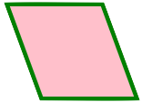

# :no_good: Why you should never use `!important`

Using `!important` in a large complex stylesheet system is a terrible idea. It makes it nearly impossible to build upon a pre-existing design, and gives all your coworkers many a headache. Avoid it at all costs.

## First of all, what is `!important`?

`!important` is a keyword that can be added to the end of a style declaration to make that rule override all contradicting rules that come after it.

For example, if you had this as your CSS:

```css
div {
  color: blue !important;
  color: green;
}
```

The `<div>` is going to be blue. Even though you told it to be green.

This `!important` keyword is extremely powerful... <!-- finish this sentence! -->


## In what order do styles get applied in CSS?

The first thing to know is that CSS is an acronym for "Cascading Style Sheets". The styles _cascade_ on top of each other when they're applied to an element. Assuming all styles have the same weight, they will be applied from top to bottom.

For example, a div with the following stylesheet

```css
div {
  border: 5px solid green;
  margin: 40px;
  height: 50px;
  width: 100px;
  background: yellow;
  transform: rotate(45deg);
  height: 100px;
  background: pink;
  transform: skew(20deg);
}
```

would end up looking like this:



The styles at the top of the declaration get applied first and the later styles (specifically `background` and `transform`) overwrite the previously applied styles.

For a visual representation of how this looks:


## Specificity

### How is specificity calculated?

## Why is `!important` so goddamn awful?

## Is is _ever_ okay to use `!important`?

Yes! There are some notable use cases where it is okay to use `!important`.

### Utility Classes (Be Careful)

### User Style Sheets

### Targeting IE 5/6

Internet Explorer versions 5 and 6 completely ignore the `!important` keyword when the same property is declared in the same block.

```css
div {
  background: blue !important;
  background: green;
}
```
